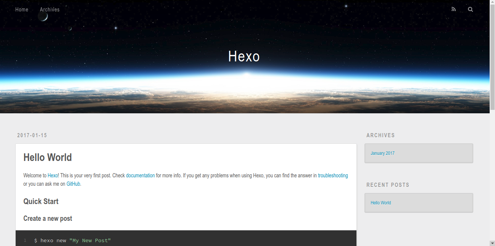
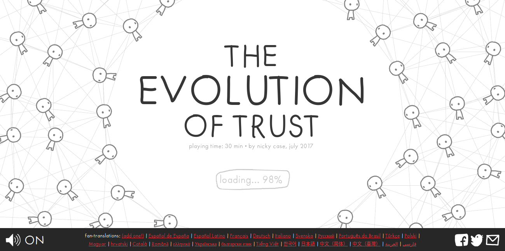

# 项目说明

* http-add-and-blog 是相对完整的最终项目，有加法和blog
* tcp-server 里面是一个简单的tcp层服务器，没有对http内容的处理
* http-server-with-static-data 只返回纯静态内容
* tcpstream 是对socket的stream包装

# 编译说明

* 请用`g++-7`或`clang-5`，或其他支持相对完整的c++17标准的编译器
* 对于低版本编译器，请切到`g++-5`分支，`g++-5`分支以适配ubuntu自带的g++-5编译器

# 运行说明

有两个最终演示效果的地方一个是`http-add-and-blog/blog`，如下图：

另一个是`http-add-and-blog/trust`，是一个从`http://ncase.me/trust/`迁过来小游戏，运行效果如下图：

加法效果是这样：

# The End
